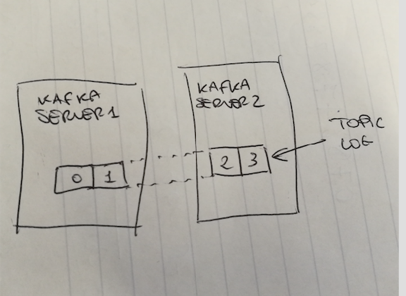

- Partitions allow to scale the topic log beyond the size of a single server. A topic is "spread" across more server
in the form of partitions.

- Each partition is replicated across a configurable number of servers - this is how fault tolerance is granted

- Each partition has one server which acts as "leader" and zero or more servers tht act as "followers"  

- Producers in Kafka can choose a partition on which to write the record in a round-robin fashion (load-balancing) 
or using a semantic key from the record (useful to preserve ordering)

- Each record written to a topic is sent to a single consumer instance of each group - this is also how 
fault tolerance is granted. Also, the more the partitions, the more we scale.

- Once NUM_CONSUMERS_IN_GROUP = NUM_PARTITIONS, since the former can't be greater than the latter, to scale you can
add new consumer groups.

- Messaging order is granted only within a partition. 
    * Producers can use semantic keys to send records semantically related only to a specific partition. 
    * Another way to keep ordering is to create a single partition topic and consumers group of size 1. 
       The order would be granted, but...
       * no more scaling possible 
       * you are broadcasting to all the consumers

